# How bioleads works

A guided tour of the pipeline: what each stage does, why it's there, what it
produces, and which control changes it. If you just want to get a run going, see
[getting_started.md](getting_started.md); this page is for understanding what
came out and deciding what to change.

---

## The idea

A literature search gives you papers. bioleads tries to give you *leads*: the
concepts that make your corpus distinctive, how those concepts connect, and
which pairs of concepts look related through the literature without any paper
having actually connected them.

The last part is the point. It's the **Swanson ABC model** of literature-based
discovery: if concept **A** keeps appearing alongside intermediates **B**, and
those same **B** appear alongside concept **C**, but **A** and **C** never appear
together, then A–C is a connection the literature implies but hasn't stated.
Swanson's original case linked dietary fish oil to Raynaud's syndrome through
blood-viscosity intermediates — two literatures that never cited each other.

Everything upstream of that exists to make the ABC step trustworthy: get the
right papers, pull out real biomedical entities, keep only the terms that
actually distinguish this corpus, and connect them only where the connection
beats chance.

---

## The pipeline at a glance

```
   ┌─ 1. Collect documents ──────── PubMed query · PMIDs · RIS/EndNote
   │
   ├─ 2. Grow the corpus ────────── follow citations (optional)
   │
   ├─ 3. Extract entities ───────── scispaCy biomedical NER
   │
   ├─ 4. Rank distinctive terms ─── corpus-internal TF-IDF
   │
   ├─ 5. Build the term network ─── co-occurrence, PMI-filtered
   │
   ├─ 6. Propose hypotheses ─────── Swanson ABC over that network
   │
   ├─ 7. Cluster terms ─────────── PubMedBERT + KMeans (optional)
   │
   ├─ 8. Map the citations ──────── paper→paper and lab→lab (optional)
   │
   └─ 9. Write outputs ─────────── CSVs + interactive HTML
```

Stages 1–6 always run. Stages 7 and 8 are optional and independent of each
other. Each stage consumes only what the stage above it produced, so a weak
result usually traces to one specific step — the sections below say which.

---

## 1. Collect documents

**What it does.** Loads every input you gave into one flat list of documents,
each with a title, text body, and whatever metadata the source carried (PMID,
year, journal, authors). Sources combine freely — a PubMed query *and* a list
of PMIDs *and* an EndNote export all land in the same corpus.

Every input is PMID-bearing by design. That is what lets stage 2 follow
citations and stage 8 build the citation networks, and it is why local PDFs are
not an input: a PDF carries no accession, so a document from one can be counted
and ranked but can never be expanded from or placed in a citation graph.

| Input | What's read |
|---|---|
| **PubMed query** | an Entrez search; title + abstract of each hit |
| **PubMed IDs** | specific records, inline or from a file |
| **References file** | RIS or EndNote XML export; title + abstract as written |

Every document is a title and an abstract. Pulling **full text** for the
articles that are open-access in PubMed Central was offered once and removed:
on a 147-paper corpus only 28% could be upgraded, and those documents ran about
30× longer than the abstracts around them. They then supplied 87% of all term
mentions and — because a document's co-occurrence pairs grow with the *square*
of its length — 99% of the network's edges. Stages 4 to 6 were describing the
open-access subset rather than the corpus, and open access tracks funder,
journal and recency rather than relevance. Uniform abstracts are the less
informative input and the more honest one.

**Why it matters downstream.** This is the only stage that decides what the
corpus *is*. Every later stage describes this document set and nothing else, so
a biased or too-small corpus produces confident, well-scored nonsense.

**Controls.** PubMed query · PubMed IDs · References file · Max query hits
(caps how many hits a PubMed search fetches, default 500).

---

## 2. Grow the corpus by following citations

**What it does.** Optional. Starts from the documents that carry a PMID, walks
the citation graph outward, and appends what it finds. A reference record with
no accession can't seed this — there is nothing to follow.

Before any of the mechanism, a map of the vocabulary. Everything in this stage is
one idea — a list of numbers — used at four sizes, and every term below names a
different size of it.

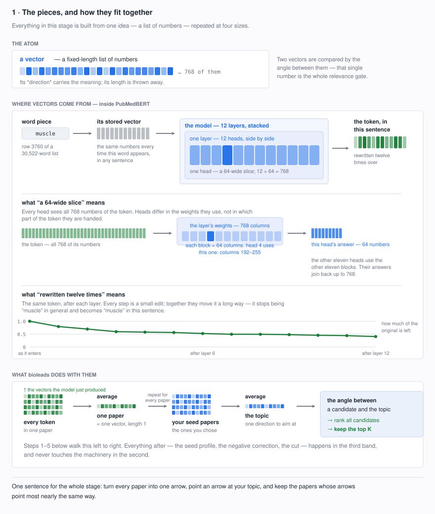

The middle band is the language model. bioleads does not touch it: it is used
as-is and only ever asked for one thing, a vector per paper. Every decision this
stage makes happens in the bottom band.

Two phrases in that band are worth unpacking, because both are easy to read
wrongly.

**"A 64-wide slice"** does not mean the head is handed 64 of the token's numbers.
Every head sees the token *whole*, all 768. What is cut into twelve is the
**weights**: the layer holds a 768 × 768 block of them, head 4 uses columns
192–255, and putting 768 numbers through 64 columns gives 64 numbers back. The
other eleven heads use the other eleven blocks of columns, and their eleven
answers join back up to 768. So the heads differ in *which weights they apply*,
never in which part of the token they get.

**"Rewritten twelve times over"** means the token's vector is replaced at every
layer, each version built from the one before. No single step changes it much —
consecutive versions stay above 0.79 cosine, and mostly above 0.95 — but the
changes compound. By the final layer the vector retains a cosine of **0.403** to
the one that entered layer 1. It never stops being `muscle`; it stops being
`muscle` in general and becomes `muscle` in this sentence. What each of those
twelve rounds contributes, and whether this stage needs all of them, is measured
in step 1.

### The problem

Every seed sits between two very different sets of papers.

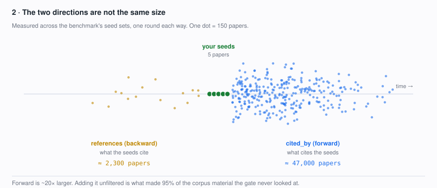

Those counts are measured, not illustrative: across the systematic-review seed
sets in [the benchmark](benchmark.md), one round backward yielded 2,342 papers
and one round forward roughly 47,000. **Forward is ~20× larger**, and that size
difference drives everything that follows.

The two directions also differ in kind. A reference list is everything the
authors needed — the method, the reagent, the statistical tool, the mouse line,
background from an adjacent field, a courtesy citation — so it is a union of
topics. Citing papers usually engage with what a seed showed, but a widely-used
method or reagent paper is cited by every field that uses it.

Taking either wholesale is what makes plain snowballing drift: one round drags
in every field the seed touched, and the next round expands from *those*. Yet
backward is also where the foundational literature lives, which is exactly what
ABC discovery (stage 6) needs. So the goal is not to skip a direction but to
**filter both**.

The question this stage answers is therefore: *how do you keep the useful
citation neighbours without letting the corpus explode or drift?*

bioleads' answer is to treat **the seed papers as the definition of the topic** —
they are the only papers known to be on topic, because you chose them — and to
make every candidate earn its place against them.


What follows is one continuous geometric story. Papers become arrows; the seeds
define a direction; candidates are ranked by the angle they make with it; and a
correction can rotate that direction away from the kinds of paper that keep
scoring well without belonging.

### Step 1 · Every paper becomes a vector

Everything below rests on one idea: **turn each paper into a list of numbers, so
that papers about similar things end up with similar lists.** If you already know
what a sentence embedding is, skip to the equations.

The model reads text in pieces called **tokens** — roughly words, but split
further when a word is unusual, so a fixed vocabulary can spell anything. Our
sentence becomes ten of them, including two markers the model adds to show where
the text starts and ends:

```
[CLS]  trpv1  mediates  vasodilation  in  arterial  smooth  muscle  .  [SEP]
```

`trpv1` survives as one token because PubMedBERT was trained on biomedical text
and carries it in its vocabulary. A general-purpose model shatters the same word
into four pieces — `tr`, `##p`, `##v`, `##1` — and has to reassemble the meaning
from fragments. That is most of why a domain model is worth using here.

**How a token becomes a number.** The vocabulary is a fixed list of 30,522 word
pieces, and a token's "number" is simply *its position in that list*:

| token | `[CLS]` | `trpv1` | `mediates` | `vasodilation` | `arterial` | `[SEP]` |
|---|---|---|---|---|---|---|
| row | 2 | 17501 | 10412 | 21742 | 6624 | 3 |

Nothing is computed to get there — it is a dictionary lookup, and any word piece
outside those 30,522 entries cannot be represented at all, which is exactly why
rare words get split until the pieces are all in the list.

That row number then indexes a second table of **30,522 × 768 numbers** learned
during training: one row of 768 per vocabulary entry. So a token *starts* as the
768 numbers stored for it.

Those stored numbers know nothing about the sentence — `muscle` starts identically
in "arterial smooth muscle" and "he lost muscle mass". That is the problem the
twelve transformer layers exist to solve. In each layer, **every token looks at
every other token** and is rewritten in light of them, twelve times over.

**What "looks at" means.** That phrase is the load-bearing one in this whole
section, so it is worth spending a paragraph on rather than leaving as a
metaphor. Nothing is inspected, and no token can see inside another. Three short
vectors are derived from each token, *from its own numbers alone*:

| | the jargon | what it is for |
|---|---|---|
| a **request** | query | what this word would like to find |
| an **offer** | key | what this word advertises about itself |
| a **contribution** | value | what this word hands over if chosen |

For one token, its request is multiplied against every token's offer. Each such
multiplication collapses to **one number** — a match score, nothing more. Those
scores are then squashed so they sum to 1, and *that* is the whole of the
"looking": the numbers become **proportions**. The token's correction is those
proportions applied to the other tokens' contributions — a weighted blend.

So **"token A looks at token B"** means, exactly: *A's request was multiplied by
B's offer, that one number became a proportion, and B's contribution was mixed
into A in that amount.* A word given a proportion of 0.999 is being copied almost
whole; one given 0.0005 is, for that round, ignored.

The phrase is used throughout the rest of this section, and it always means that.
It is worth keeping precisely because the alternative — "computes a
softmax-weighted sum of value projections" — describes the arithmetic while
hiding what it is for.

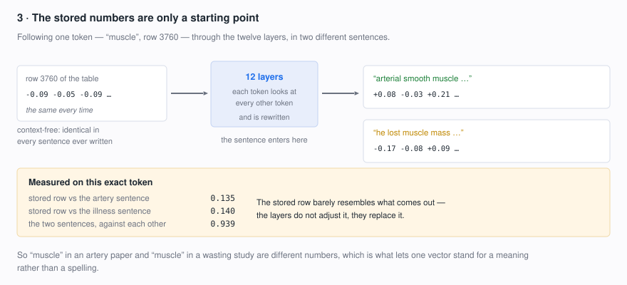

It is worth seeing how violent that rewrite is. Following the single token
`muscle` through the model:

| compared | cosine |
|---|---|
| its stored row vs. its vector in the artery sentence | **0.135** |
| its stored row vs. its vector in the illness sentence | **0.140** |
| the two sentence versions against each other | 0.939 |

The stored row barely resembles what comes out. **The layers do not adjust the
lookup, they largely replace it** — the row number is closer to an index than to a
meaning. And the same word in two different sentences ends up as genuinely
different numbers, which is what lets a vector stand for a *meaning* rather than a
*spelling*. It is also why the whole approach beats counting words: `myocyte` and
`muscle cell` can land near each other without sharing a single character.

**Why 768?** It is not derived from the data or the vocabulary. It is the width
the model was built with — the "base" size in the BERT family — and every token
vector at every layer has exactly that many numbers. It is divisible the way the
architecture needs: 12 attention heads × 64 numbers each = 768. Larger variants
use 1024 or more and are correspondingly slower; smaller ones lose accuracy. For
our purposes 768 is simply a fixed, inherited constant, and no individual one of
those numbers means anything on its own — only the whole pattern does.

**What a layer and a head actually are.** A **layer** has two halves. The first
is that looking step — **attention** — and it is the *only* place one token's
numbers can reach another. In the second, a
small network called a **feed-forward** transforms each token entirely on its
own, reading nothing else; it is four times wider inside than the vector it
works on (768 → 3072 → 768) and holds most of the model's parameters.

"Looks at" has a precise meaning. Each token distributes one unit of **attention**
across the sentence, and the resulting weights decide how much of each other
token gets mixed in. A token that spends 0.99 of its attention on one word is,
for that round, essentially copying it.

**What a head is, exactly.** Not a module you could point at — a *slice*. Each
layer holds three learned 768 × 768 matrices, and head 8 owns columns 512–575 of
each: its 64-wide share. Run a token's 768 numbers through those three slices and
you get three 64-number vectors, which are given three different jobs:

| | what it is | plain reading |
|---|---|---|
| **query** | the token through this head's slice of the first matrix | what this word is looking for |
| **key** | every token through its slice of the second | what each word offers |
| **value** | every token through its slice of the third | what actually gets passed on |

Queries and keys exist separately because the two are not the same question — what
a word is looking for and what it advertises about itself are different, and the
comparison between them is deliberately asymmetric.

The head compares its one query against every key by dot product, divides by √64
to keep the numbers in a range where the next step behaves, and softmaxes the
results into weights that sum to 1. Its answer is then the weighted sum of the
*values* — 64 numbers.

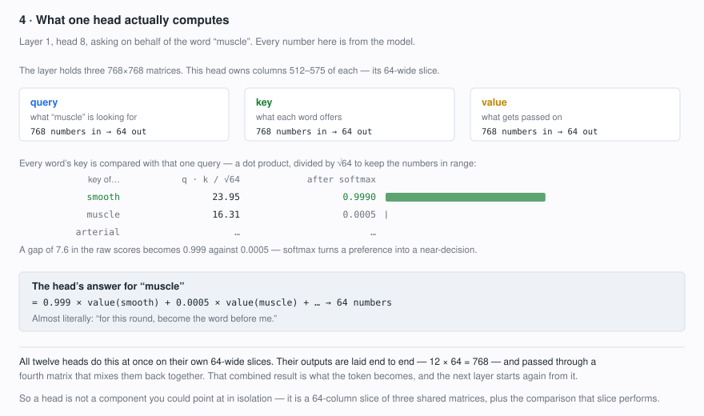

For `muscle` in layer 1 head 8, the key for `smooth` scores **23.95** against that
query and the next best scores 16.31. After the softmax that gap of 7.6 becomes
**0.999 against 0.0005** — softmax turns a preference into very nearly a decision,
and the head's output is essentially "for this round, become the word before me".

All twelve heads do this at once on their own slices. Their 64-number answers are
laid end to end — **12 × 64 = 768** — and passed through a fourth matrix that mixes
them back together; that result is what the token becomes, and the next layer
starts from it.

So a head is a 64-column slice of three shared matrices plus the comparison that
slice performs. Nothing more concrete than that exists to point at. (The account
above is not a paraphrase: recomputing this head by hand from the raw weight
matrices reproduces the model's own attention to 3 × 10⁻⁷.)

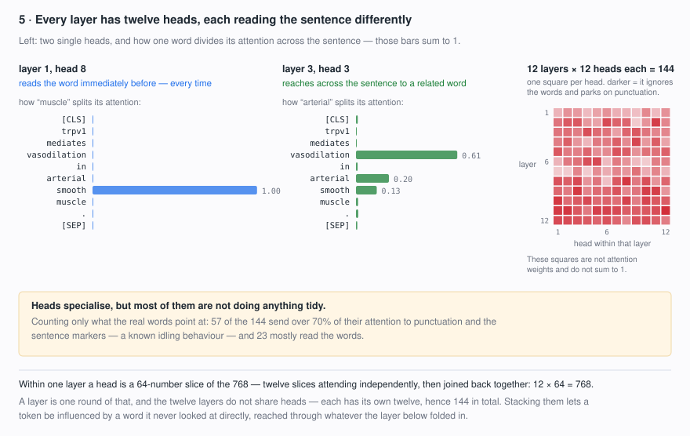

Heads do specialise, and some are strikingly literal. Layer 1 head 8 gives 0.999
of `muscle`'s attention to `smooth`, the word immediately before it — and it does
the same thing on an unrelated sentence, averaging 0.99 on the preceding token
throughout. Layer 3 head 3 instead reaches across the sentence, linking `arterial`
to `vasodilation` at 0.61.

**Where 144 comes from:** the twelve layers do not share heads. Each layer has
its own twelve, so the model contains 12 × 12 = 144 of them, and the grid in the
figure has one square per head — rows are the layers, columns are the twelve
heads *within* that layer. (Those squares are a summary statistic, not attention
weights; only the bars on the left sum to 1.)

But it would be misleading to suggest all 144 have tidy jobs. On the sentence
above, counting only what the real words point at, **57 of them send over 70% of
their attention to punctuation and the sentence markers** — a known idling
behaviour, where a head with nothing to contribute parks its attention somewhere
harmless. Just 23 mostly read the actual words. How many idle depends on the
text: run the same test over 1,500 real titles and it flags 33 rather than 57,
because short input has proportionally more punctuation to park on. Either way
the useful mental model is not twelve experts with twelve labelled specialities,
but a large pool of cheap, partly-redundant pattern detectors of which a minority
matter for any given sentence — and, as the next section shows, the idle ones sit
almost entirely in the last five layers.

**And "rewritten" means added to, not replaced.** Neither half overwrites the
vector. Each computes a *correction* and adds it to what was already there — a
residual connection — with a rescaling step (LayerNorm) after each addition to
keep the numbers in a workable range.

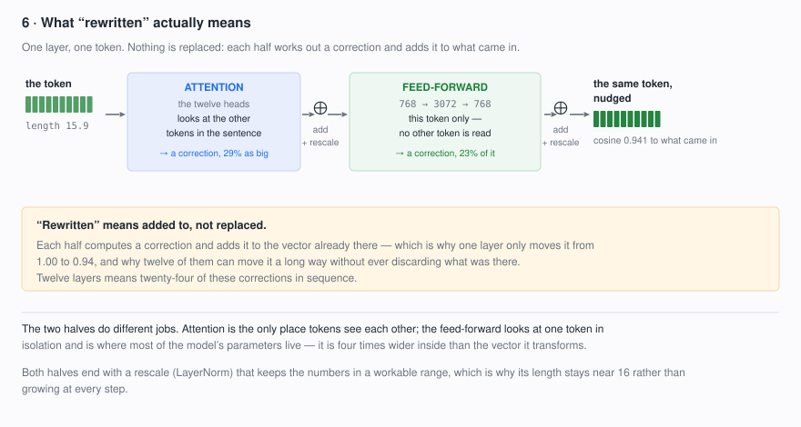

Measured on `muscle` at layer 3: the vector arrives with length 15.9, attention
contributes a correction 29% that size, the feed-forward then contributes another
23%, and the vector leaves at a cosine of **0.941** to the one that entered. One
layer nudges; it does not replace. Twelve layers means **twenty-four** such
corrections in sequence, which is how the token can travel from 1.00 to 0.403
against its starting point without any single step discarding what was there.

That also settles what a token can be influenced by: because each round starts
from the last one's output, a word can affect a token it never directly attended
to, reached through whatever the layer below folded in.

**Why they are called layers.** The word is older than transformers and comes
from how these networks are drawn: a row of units all computed at once, then
another row computed from that row's output, stacked upward like strata. Here it
means something specific. **One layer is one complete round of "attention, then
feed-forward", holding its own private copy of every weight it uses.** The twelve
rounds do not reuse one set of weights twelve times — each layer holds
**7.09 million** parameters of its own, and the twelve together are **85.1M of
the model's 109.5M**, the 30,522-row lookup table being most of the rest. The
layers *are* the model.

Two things follow from the name that are worth holding onto. Everything inside a
layer is computed at the same moment, from the layer below and nothing else —
that simultaneity is what makes it a layer rather than a step in a loop. And
"layer" here names a *block* of two sublayers, which is why twelve layers give
**twenty-four** corrections, and why asking the library for the hidden states
returns **thirteen** arrays: the lookup table's output, then one per layer.

**Why twelve.** For the same reason there are 768 numbers: it was inherited, not
chosen. PubMedBERT is BERT-base retrained on PubMed, and BERT-base is 12 layers
× 12 heads × 768 wide — a shape picked in 2018 to match the size of the model
BERT was being compared against, then kept by everything built on it. The
larger variant doubles the depth to 24 and widens to 1024. bioleads did not
choose twelve; it chose a model that has twelve, the way you inherit a file
format.

What *depth* is for is easier to say than what twelve is for. Range is not the
reason: one layer's attention already reaches every token in the text. What a
second layer buys is **composition** — its attention can only mix what the layer
below already assembled, so it can attend to a token that is by then "the token
that folded in `smooth` and `muscle`", and a third to whatever that became.
Depth buys ply, not reach.

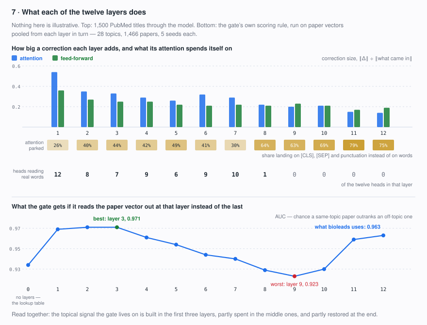

**What each one does.** Not jobs — tendencies. Measured over 1,500 real PubMed
titles:

| layer | attention correction | feed-forward correction | attention on markers | span | heads reading words | contextualisation |
|---|---|---|---|---|---|---|
| 1 | 0.54 | 0.36 | 26% | 7.1 | 12 | +0.252 |
| 2 | 0.35 | 0.27 | 40% | 7.3 | 8 | +0.132 |
| 3 | 0.33 | 0.25 | 44% | 7.3 | 7 | +0.081 |
| 4 | 0.29 | 0.25 | 42% | 7.1 | 9 | +0.015 |
| 5 | 0.26 | 0.22 | 49% | 8.0 | 6 | +0.045 |
| 6 | 0.32 | 0.21 | 41% | 6.5 | 9 | +0.044 |
| 7 | 0.29 | 0.22 | 30% | 4.5 | 10 | +0.009 |
| 8 | 0.22 | 0.21 | 64% | 8.2 | 1 | −0.014 |
| 9 | 0.20 | 0.23 | 63% | 8.7 | 0 | +0.007 |
| 10 | 0.21 | 0.21 | 69% | 9.1 | 0 | +0.012 |
| 11 | 0.15 | 0.17 | 79% | 10.0 | 0 | +0.039 |
| 12 | 0.14 | 0.19 | 75% | 9.6 | 0 | +0.048 |

The two correction columns are ‖correction‖ ÷ ‖what came in‖, the same
measurement Figure 6 makes on one token. **Attention on markers** is the share
landing on `[CLS]`, `[SEP]` and punctuation rather than on words; **span** is the
average distance in tokens between a word and what it attends to; **heads reading
words** counts, of that layer's twelve, how many are not dominated by anything
else — under half their attention on markers, under half on the preceding token,
under half on themselves.
**Contextualisation** is the layer's share of the total separation of a word from
its own occurrences elsewhere — how much of the "`muscle` stops being `muscle` in
general" happens right there.

Two things fall out of that table.

*The first layer does the most of everything.* Its correction is the largest by
half again, and **38% of all the contextualisation in the model happens in it**;
70% has happened by the end of layer 3. Layers 1–3 are where a word stops being
a dictionary entry.

*Layers 1–7 read the sentence; 8–12 largely stop.* Six to twelve heads per layer
are still reading words through layer 7 — layer 7 most locally of all, with a
mean span of 4.5 tokens and 23% of attention going straight to the preceding
word. From layer 8 there is at most one such head, five to nine heads park over
70% of their attention on markers and punctuation, and the corrections shrink.
The back half of the model does most of its work in the feed-forward half, on
each token alone.

**Does the gate need all twelve?** The rest of step 1 turns these token vectors
into one vector per paper by averaging them and scaling to length 1. Do that at
*every* layer instead of only the last, and you can ask which layer the gate
would actually prefer — the lower panel of Figure 7. The test uses 28 topics
(two independent draws of 14 reference lists), 1,466 title-and-abstract records,
five random seeds per topic, 25 draws each, scored exactly as step 3 scores
candidates; AUC is the chance a same-topic paper outranks an off-topic one.

| read out at | 0 (lookup) | 1 | 3 | 6 | 9 | 11 | 12 |
|---|---|---|---|---|---|---|---|
| AUC | 0.934 | 0.969 | **0.971** | 0.944 | 0.923 | 0.959 | 0.963 |
| precision @ 50 | 0.640 | 0.695 | **0.698** | 0.636 | 0.591 | 0.663 | 0.674 |

Everything the gate lives on is in place by **layer 3**, and the middle-late
layers are *worse* than the early ones — the fall from layer 3 to layer 9
(0.048) is larger than the whole model's gain over the raw lookup table
(0.029). The curve is U-shaped: topical signal is built early, spent on work
the gate does not use, then partly restored at the end.

Deleting layers tells the same story from the other side. Skip any single layer
and re-run the whole test: the paper's vector moves by at most **0.026** cosine
(against a background where two *unrelated* papers already sit at 0.984), and the
AUC moves by at most 0.013 — **six of the twelve deletions leave it slightly
better**. Only removing layer 11 clearly hurts. No single layer is load-bearing
here, which is what a stack of small additive corrections predicts.

So the honest answer to "why twelve" is that this stage did not need twelve and
did not pick twelve. Twelve is the shape of the model it borrowed, mean-pooling
the last layer is the convention rather than a tuned choice, and the measurement
says a layer-3 readout would be slightly better on this task — worth about 0.008
AUC and two points of precision@50. That is a proxy, not the benchmark: topics
defined by one paper's reference list are cleaner than a real expansion round,
and nothing here has been through [the benchmark](benchmark.md). The two
independent draws also agree on the shape of the curve but not on the size of the
prize — the layer-3 advantage in precision@50 is 0.2 points in one and 4.6 in the
other. It is a flagged possibility, not a change.

**Averaging the tokens.** The gate needs *one* vector per paper, and what we have
is one per token, so they are averaged — the simplest way to combine them, and the
one bioleads uses. "Real tokens" in the equation below means the actual words:
sentences in a batch are padded to equal length so the arrays are rectangular, and
those padding slots are excluded so a short abstract is not diluted by its own
padding.

Averaging costs something, and it is worth knowing what. Word order is largely
flattened. Measured on two sentences that differ only by swapping subject and
object:

| pair | cosine |
|---|---|
| "TRPV1 activates TMEM184C" vs "TMEM184C activates TRPV1" | **0.9988** |
| the same sentence vs. a different claim entirely | 0.9814 |

Reversing the direction of an interaction changes the paper's vector *less* than
changing its subject does. So this representation is good at "which topic is this
about" and poor at "what exactly does it claim" — which is fine here, because the
gate's only job is topical filtering, and the co-occurrence network in stage 5 is
undirected anyway. It would not be fine for extracting directed claims, and
nothing downstream should be read as doing that.

Averaging does one more thing, which only becomes visible in step 3: it
**concentrates whatever every token has in common**. The parts of the tokens that
differ partly cancel; the part they share does not. That is why the paper vectors
end up crowded into a narrow cone — see *where the 0.99s come from*, below.

The average is finally scaled to length 1 so only its *direction* matters.
That is the whole of step 1:

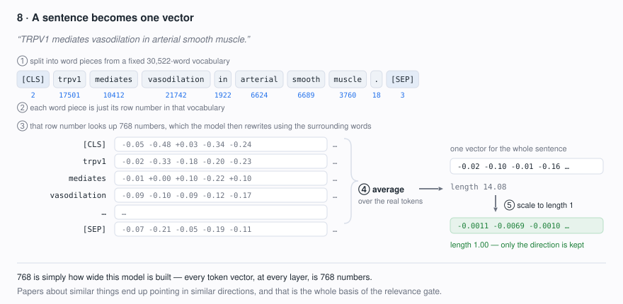

Now the formal version of exactly that picture. PubMedBERT emits a vector
$\mathbf{h}_t$ per token, and bioleads averages the *real* tokens — skipping the
padding that makes a batch rectangular:

$$\mathbf{e}_d \;=\; \frac{\sum_{t} m_t \, \mathbf{h}_t}{\sum_{t} m_t}$$

with $m_t = 1$ for a real token and $0$ for padding. *A paper's arrow is the
average of its meaningful token arrows.* Text is truncated at 256 tokens, so this
is the title and abstract, not a full article.

That arrow is then scaled to length 1:

$$\hat{\mathbf{e}}_d \;=\; \frac{\mathbf{e}_d}{\lVert \mathbf{e}_d \rVert}$$

*Keep the direction, discard the length.*

Normalising is what makes the rest of the section work. It places every document
on the unit hypersphere, which removes magnitude — roughly, how much text there
was — from every later comparison, and it makes a dot product equal a cosine.
From here on, **direction carries all the meaning**.

### Step 2 · The seeds define a direction

Average the seed arrows and you get one arrow standing for what they share.

$$\mathbf{q}_0 \;=\; \frac{\bar{\mathbf{e}}_S}{\lVert \bar{\mathbf{e}}_S \rVert}, \qquad \bar{\mathbf{e}}_S \;=\; \frac{1}{|S|}\sum_{d \in S} \hat{\mathbf{e}}_d$$

*Average the trusted papers, then put the result back on the unit sphere.*

The intermediate length $\lVert \bar{\mathbf{e}}_S \rVert$ is worth a moment,
because it quietly measures how much the seeds agree. Averaging unit arrows that
point the same way barely shortens them; averaging arrows that disagree produces
something much shorter, pointing between them.

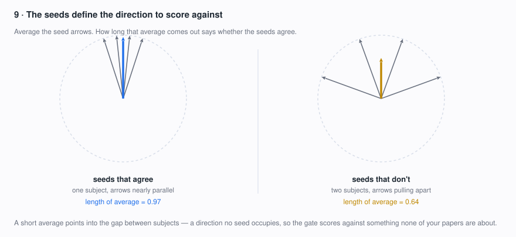

This is the geometry behind the documented failure mode: a seed set covering two
subjects averages to a direction in the gap between them, and can rank papers
from *neither* highly.

It is tempting to read $\lVert \bar{\mathbf{e}}_S \rVert$ back out as a
"seed coherence" diagnostic. **That was tried and it does not work**, for a
reason worth knowing about the embedding space itself. Mean-pooled PubMedBERT
vectors are strongly *anisotropic*: they occupy a narrow cone rather than
spreading over the sphere. Measured on five deliberately unrelated papers — gut
microbiome, HIV virology, urban blight, microglia, cervical cancer screening —

| quantity | value |
|---|---|
| pairwise cosine between unrelated papers | 0.986 (range 0.983–0.991) |
| $\lVert \bar{\mathbf{e}}_S \rVert$ for those five | **0.9945** |
| the same, after removing the shared direction | −0.25 mean pairwise |

About **99.5% of every unit document vector is one direction common to all
biomedical text**, leaving roughly 10% that is about the paper. So the centroid
norm reads ~0.99 whether the seeds share a topic or not, and cannot distinguish
the two. Centring fixes the geometry — unrelated papers become correctly
dissimilar — but centring a set on its own mean makes the mean pairwise cosine
exactly $-1/(k-1)$, a function of $k$ alone, so a self-referential version
carries no information either. A usable diagnostic would have to centre on an
external background, and would need validating against seed sets of known
coherence.

The gate itself is unaffected, because it never uses absolute magnitudes — it
ranks. But it is the reason step 3 insists the ranking, not the score, is the
signal.

### Step 3 · Candidates are ranked by angle

A candidate belongs if its arrow points nearly the same way as the topic arrow.

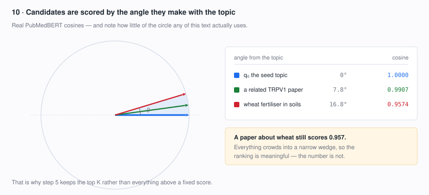

$$s_c \;=\; \hat{\mathbf{e}}_c \cdot \mathbf{q}_0 \;=\; \cos\theta_c \;\in\; [-1, 1]$$

*Score a candidate by the cosine of the angle between it and the topic.*

The dot product *is* the cosine here only because step 1 normalised both arrows:
the usual $\lVert\mathbf{a}\rVert\lVert\mathbf{b}\rVert$ denominator is 1, so it
disappears. A score of 1 means identical direction, 0 means unrelated.

In practice biomedical abstracts all occupy broadly similar semantic space, so
absolute values cluster high and mean little on their own — measured across a
real candidate pool, every raw cosine falls between 0.985 and 0.991.

It is worth seeing *why*, because it looks like a bug and is not. Of the 768
numbers, **one is very nearly the same for every text there is**:

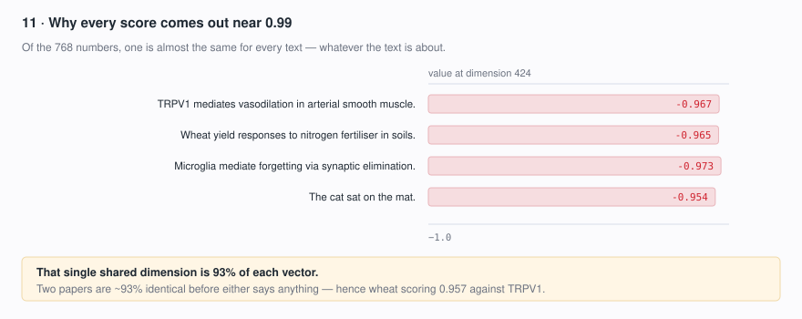

Dimension 424 sits at roughly −0.96 for a TRPV1 paper, a wheat-fertiliser paper,
a microglia paper, and the sentence "the cat sat on the mat" alike, and accounts
for about 93% of each vector's squared length. Two documents are therefore ~93%
identical before either one says anything — which is the whole explanation for
scores that never leave the high nineties. Language models are known to do this;
the vectors occupy a narrow cone rather than spreading over the sphere. **The useful
signal is the ranking**, which is why the cut in step 5 is a rank, not a
threshold.

**Where the 0.99s come from.** The cone is not something the biomedical
vocabulary does, and it is worth being able to say what does it, because it is
the one property of the representation that every score in this stage inherits.
Traced back through the model, the lookup table turns out to be innocent and
three later steps build it:

| where | what happens to dimension 424 |
|---|---|
| the 30,522-row lookup table | nothing. Its rows are near-orthogonal — mean pairwise cosine **0.068** — and no dimension dominates: the largest carries 0.63% of a row's squared length, and 424 carries **0.19%** |
| assembling the input | the moment word, position and segment vectors are added and rescaled, 424 carries the largest average value of any dimension (−4.1). The trained parameters single it out: that step's bias for it is **+1.62**, where no other dimension's exceeds 0.39 |
| the twelve layers | they amplify it. A token's share of squared length at 424 rises from **15%** at the input to **76%** by layer 12 |
| averaging the tokens | it concentrates further, because every token carries it and the informative parts partly cancel: the pooled paper vector sits at **92%** where its own tokens sit at 76% |

So the crowding is an artefact of one hard-wired direction, amplified by depth
and then by pooling — not a statement that all biomedical papers are alike. It is
also entirely removable: centring the pool (below) takes dimension 424 from 91%
of a vector's squared length to **0.2%**, and the mean cosine between papers from
0.985 to **−0.002**. Whether that is worth doing is the next question, and the
answer turns out to be "for the score you read, not the one that selects".

That also makes the raw number useless to *report*. Every kept document carries a
`relevance` score in its metadata, and a column of 0.98s tells a reader nothing.
So the score written out is the **centred** one — the candidate pool's mean
removed, which widens the spread about 30× into a readable range — while
selection stays on the raw cosine that was benchmarked.

Centring was tested for selection too, and does not help. Over 40 reviews it
loses on median F1 at both cutoffs (K=50: 0.0958 → 0.0891; K=100: 0.0971 →
0.0868) and on the paired comparison (23–16 at K=50, 19–18 at K=100), while
finding the same number of true papers — 308 either way at K=50. The reason is
mechanical: centring changes the *spread* of the scores about 30× but barely
their *order* (Spearman ρ ≈ 0.89, 5/5 overlap in the top 5), and a rank cutoff
only reads order. So it is applied to the reported value only, where a readable
range is exactly what is wanted.

So the two numbers do different jobs: the raw cosine decides *which* documents
survive, and the centred one is what you read — and what the kept list is
ordered by, highest first.

### Step 4 · The gate learns what the topic is not

Pointing at the topic is not the same as pointing away from what resembles it.
A methods paper that shares the seeds' technical vocabulary can sit at exactly
the same angle to $\mathbf{q}_0$ as a genuinely on-topic paper — because the seed
papers use that vocabulary too. No amount of aiming at the topic separates them.

So the gate also learns from its own worst matches. Take the lowest-scoring
candidates, average them into a direction, and tilt the topic vector away from it:

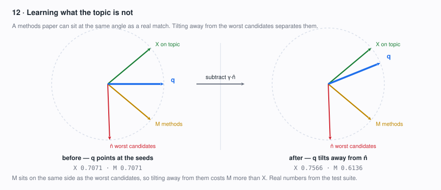

$$\hat{\mathbf{n}} \;=\; \frac{\bar{\mathbf{e}}_N}{\lVert\bar{\mathbf{e}}_N\rVert}, \qquad \mathbf{q} \;=\; \frac{\mathbf{q}_0 - \gamma\,\hat{\mathbf{n}}}{\lVert \mathbf{q}_0 - \gamma\,\hat{\mathbf{n}} \rVert}$$

*New topic direction = seed direction − γ × off-topic direction.*

Candidates are then re-scored against $\mathbf{q}$. This is **pseudo-relevance
feedback** in Rocchio's classical form, with one bioleads-specific choice: the
negatives are the candidate pool's own low-scoring tail, $N$.

That choice is what makes them useful. Random papers would be easy negatives, and
the gate would learn "this topic versus all of biomedicine". The tail instead
holds papers that were citation-adjacent and plausible enough to enter the pool
yet still scored badly — which is precisely the distinction the gate has to make.
They also cost nothing: candidates are embedded once, scored to find the tail,
then re-scored, so the second pass is a dot product rather than another model
call.

From the regression test, with real numbers:


X and M start tied at 0.7071. The negative term moves them to 0.7566 and 0.6136
while pushing the tail from 0.3693 to about 0.14.

Three guards keep the correction from firing when it would be meaningless:
$\gamma \le 0$ disables it entirely and recovers the plain centroid; a pool
smaller than `rocchio_min_candidates` (8) has no tail worth trusting; and the
tail is clamped so it can never reach into the top $K$ about to be kept, since a
paper should not be evidence of what the topic *isn't* while also being kept as
on-topic. (Re-scoring can reorder, so that last guard acts on the first-pass
ranking.)

### Step 5 · Keep the top K

Sort by score, keep the best $K$, discard the rest before they ever reach the
corpus.

Forward and backward candidates pass through the same gate **independently**,
each keeping its own $K$, so one round adds at most $2K$ documents.

$K$ is a **rank cutoff, not a similarity threshold**. If a pool is weak, the top
$K$ still contains weak papers; if hundreds are strong, $K$ is still the ceiling.
That is exactly why it — and not $\gamma$ — is the main control over how broad
the corpus gets.

Benchmarked, precision falls and recall rises as $K$ grows (12 reviews):

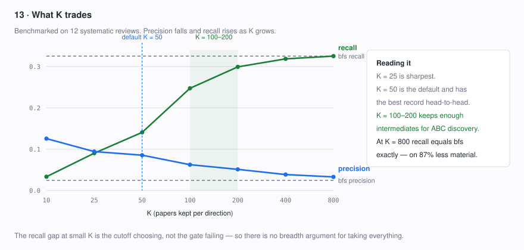

The bottom two rows are the point: **at $K = 800$ the gate reaches exactly the
recall of unfiltered snowballing, 0.3252, on 87% less material.** The recall gap
at smaller $K$ is the cutoff choosing, not the gate failing — so there is no
breadth argument for taking everything.

Pick $K$ by what stage 6 needs rather than by F1:

- **$K \approx 10\text{–}25$** — sharpest (F1 peaks at 25); a tight corpus to read yourself.
- **$K = 50$** (default) — best paired record of any $K$: better F1 than `bfs` in
  11 of 12 reviews, than raw `backward` in 10 of 12, and best of any $K$ in 7 of 12.
- **$K \approx 100\text{–}200$** — for ABC discovery, which can only find an A–C
  pair if some B is in the corpus: 76–92% of `bfs`'s recall at 2.1–2.6× its median
  precision (13–18× by pooled precision), on 93–96% less material.

### The same five steps without PubMedBERT

With the `embed` extra absent, the identical geometry runs in term space instead.
A document's "arrow" is the 0/1 indicator of the NER terms it contains; the
profile is a term vector weighted by how many seed documents use each term,

$$p_t \;=\; \bigl|\{\, d \in S : t \in \text{terms}(d) \,\}\bigr|$$

and the score is the same cosine, with $\sqrt{|C|}$ standing in as the length of
a binary vector with $|C|$ ones:

$$s_C \;=\; \frac{\sum_{t \in C} q_t}{\lVert \mathbf{q} \rVert \cdot \sqrt{|C|}}$$

The negative term works identically, subtracting a term vector built from the
tail. The upgrade to PubMedBERT is automatic when the extra is installed, and a
failure in the embedding path falls back here rather than sinking the run.

### The parameters

| control | symbol | default | what it changes |
|---|---|---|---|
| `expand_strategy` | | `bfs` | an ungated snowball (the default), or `relevance` for this gate; **`relevance` measured better** (below), and the default `bfs` bypasses everything else in this table |
| `expand_rounds` | | 0 | **expansion is off until this is ≥ 1**, whichever strategy is set. Above 0 `relevance` runs one gated round in each direction; `bfs` treats it as a depth |
| `expand_top_k` | $K$ | 50 | papers kept **per direction**; the main control over corpus size and cleanliness |
| `rocchio_gamma` | $\gamma$ | 0.25 | weight of the negative term — measured to change almost nothing |
| `rocchio_neg_frac` | | 0.25 | fraction of the pool taken as the negative tail |
| `rocchio_min_candidates` | | 8 | pools smaller than this skip the negative term |
| `expand_fwd_rounds` / `expand_back_rounds` | | 1 / 1 | depth in each direction; not exposed in the GUI |
| `expand_max` | | 1000 | hard cap on total PMIDs |
| `expand_source` | | `all` | NCBI ELink, NIH iCite, or the union |

One GUI behaviour is easy to get wrong: **`Follow` is ignored** by `relevance`,
which always does both directions and gates each. "Citation expansion rounds"
now means the same thing for both strategies — 0 is off — though `relevance`
treats any value above 0 as one gated round each way rather than as a depth.

### What the measurements showed

This design replaced an earlier one **on evidence**, and the evidence is kept
visible because it contradicts the intuition the original was built on. Method
and full tables: [docs/benchmark.md](benchmark.md). Ground truth is a systematic
review's reference list; seeds are sampled from it; each arm tries to recover the
rest.

**The original design** profiled on the seeds *plus* their forward citers, added
every citer ungated, and filtered only backward references — on the theory that
citing papers converge on a seed's topic while reference lists sprawl.

**The asymmetry runs the other way.** Over 40 reviews, backward was *more*
precise than forward in **33 of 40**: forward P 0.0152 / R 0.1154 against backward
P 0.0530 / R 0.1667. Comparable true hits (403 vs 397), but forward drags 2.88×
the volume.

**The gate governed 5% of the output.** Backward references were 2,342 of the
~49,700 documents returned; the other ~95% were ungated forward citers. The
profile, the negative term and $K$ were all tuning one twentieth of the result —
and the cleaner twentieth. That is also why $\gamma$ looked inert: $\gamma = 0
\to 0.25$ moved the total from 172 hits to **173**, one document across ~48,000
retrieved. Re-running on full abstracts instead of titles changed nothing
(172 / 173 / 172), refuting the obvious "scoring fidelity" explanation.

**Gating the other way is much better** (12 reviews):

| arm | median P | median R | median F1 | retrieved | pooled P |
|---|---|---|---|---|---|
| `relevance` (original) | 0.0247 | 0.2659 | 0.0434 | 47,974 | 0.36% |
| `both` (= bfs) | 0.0244 | 0.3252 | 0.0442 | 49,683 | 0.41% |
| `relevance_fwd` | 0.0520 | 0.1760 | 0.0718 | 2,712 | 4.46% |
| **`relevance_seeds`** | **0.0854** | 0.1406 | **0.0927** | **975** | **10.56%** |

`relevance_fwd` inverts the original (profile on backward, gate forward);
`relevance_seeds` profiles on the **seeds alone** and gates both. The latter wins:
better F1 in 10 of 12 reviews, better precision in 11 of 12, and better than
`relevance_fwd` in 11 of 12. Because the arm *least* exposed to the circularity
worry — the ground truth is itself a reference list, which could flatter an arm
that profiles on references — is the strongest, this is not an artefact.
**`relevance_seeds` is what stage 2 now implements.**

**Confirmed at 40 reviews.** The gate comparisons above are 12 reviews; re-run
on the 40-review set they hold and strengthen:

| arm | median P | median R | median F1 | pooled P | beats `bfs` |
|---|---|---|---|---|---|
| `both` (= bfs) | 0.0218 | 0.2735 | 0.0393 | 0.83% | — |
| `backward` | 0.0530 | 0.1667 | 0.0777 | 5.54% | — |
| `relevance_seeds` K=50 | 0.0822 | 0.1139 | 0.0958 | **9.55%** | 35/40 |
| `relevance_seeds` K=100 | 0.0665 | 0.2025 | **0.0971** | 7.18% | **38/40** |

At K=100 the gate finds 455 of `bfs`'s 718 hits from 6,336 documents rather than
86,155 — 63% of the findings on 7% of the material.

K=50 and K=100 are effectively tied on quality and the two summary statistics
disagree about which leads: K=100 has the better median F1 (0.0971 vs 0.0958)
while K=50 wins the paired comparison (22 of 40 against 17). Read that as a
precision/recall preference rather than a quality difference — K=100 wins recall
in 36 of 40, K=50 wins precision in 33 of 40.

**Caveats.** Scoring used iCite titles, though the abstract re-run agreed. Ground
truth is a reference list, which may favour backward-ish arms in general; a
topic-labelled benchmark would be the independent check.

### When it breaks

- **Seeds that don't share a topic.** One centroid, so a two-subject seed set
  averages into the gap between them (step 2). Run them as separate corpora.
- **Very few seeds.** With one seed, $\mathbf{q}_0$ is that paper's own arrow and
  the gate becomes "papers like this one" rather than "papers about this topic".
- **A weak pool.** $K$ is a rank, so exactly $K$ papers are kept even when none
  are close.
- **No PMIDs, no expansion.** A corpus of reference records that carry no
  accession cannot seed this at all.

### The other strategy: `bfs`

Plain snowball, no gating — and the default, though none of the machinery
above applies to it: no profile, no negative term, no $K$. Each round
takes the current frontier, adds everything linked to it, and chases those next,
up to the record cap. Direction is yours: `references`, `cited_by`, or `both`.
Use it when you want exhaustive coverage of a small, tight seed set and intend to
filter yourself — noting that on the benchmark `relevance` reaches the same
recall more cleanly at large $K$.

### Controls

Citation expansion rounds (0 = off) · Follow · Source · Strategy · Relevance
top-K · Max records.

## 3. Extract entities

**What it does.** Runs biomedical named-entity recognition over every document
and keeps the spans it finds — genes, proteins, diseases, chemicals, phenotypes,
cell types. Entities are lowercased and whitespace-collapsed so that surface
variants of the same thing count as the same term, and anything shorter than
three characters is dropped.

**Two engines, and it matters which one you got.** With the `ner` extra
installed, this is **scispaCy**, which returns curated biomedical entity spans.
Without it, bioleads falls back to a **regex extractor** — gene-like symbols
(`TP53`, `IL6R`) plus general content words minus a stopword list. The fallback
keeps the pipeline runnable without a model download, and it is genuinely
cruder: it will hand you ordinary English words as "entities". The log line
`NER engine: …` says which one ran. If your ranked terms look like vocabulary
rather than biology, that line is the first thing to check.

**Controls.** None in the GUI — the engine is whichever is installed.

---

## 4. Rank distinctive terms

**What it does.** Counts every term across the corpus and scores each one, so
that what rises is what carries weight in the topic rather than what is merely
frequent — raw counts just surface `cell`, `patient`, `expression`.

Terms appearing in fewer than 2 documents are dropped first, and the top 200
scoring terms are kept.

The score is **TF-IDF**: a term's total count damped by how many documents it
appears in, so a term used once in every paper sinks below one used repeatedly
in a few. It is corpus-internal — nothing outside the corpus is consulted.

That is a deliberately weaker question than the one this stage used to ask.
Two other methods existed, **`log_odds`** (Monroe, Colaresi & Quinn 2008,
reported as a z-score) and **`hypergeometric`** (over-representation as
−log₁₀ p), and both asked whether a term is over-represented *relative to
biomedicine at large*. Answering that needs a **background** — a term→count
distribution over a neutral reference collection — and bioleads never had one.
No background shipped with it, and the file-picker that was supposed to supply
one never had a file to point at, so every real run silently fell back to TF-IDF
while labelling its output as z-scores. The methods, the background plumbing and
the fallback are now all gone, which makes the output honest about what it is:
`ranked_terms.csv` reports TF-IDF weights, and its columns are term, score,
corpus count and document frequency.

Getting the stronger question back means finding a background worth scoring
against — all-of-PubMed entity counts from PubTator3, say — not restoring the
arithmetic, which was never the hard part.

**Controls.** *(none — the two frequency floors, `min_doc_freq` and `top_terms`,
are config-only.)*

---

## 5. Build the term co-occurrence network

**What it does.** Connects two terms when they appear in the same document more
often than chance predicts. The graph is built **only from the ranked terms of
stage 4**, not from every entity — that's what keeps it legible.

Each candidate edge is scored by **pointwise mutual information**:

> PMI(a,b) = log[ P(a,b) / (P(a)·P(b)) ]

PMI asks whether a pair co-occurs *more than their individual frequencies would
predict*. Two common terms co-occurring often is unremarkable and scores near
zero; a specific pair that reliably travels together scores high. Edges need at
least 2 co-mentions and positive PMI to survive.

Finally the graph is trimmed to its **150 most-connected nodes** so the rendered
network stays readable.

Co-occurrence is always counted at the **whole-document** level: two terms in
the same paper are co-occurring, however far apart. (`Config.cooccurrence_window`
advertises a `"sentence"` option that is not implemented — the value is never
read.)

**What it produces.** No file. The graph is an in-memory structure that stage 6
consumes; it used to be rendered as `cooccurrence.html` plus a 3D version, and
those outputs have been dropped. `PipelineResult.graph` still exposes it to the
Python API.

**Controls.** No GUI controls; adjust `Config.min_cooccurrence`, `min_pmi`, and
`max_graph_nodes` via the Python API.

---

## 6. Propose hypothesis candidates

**What it does.** The ABC step, run over the co-occurrence graph from stage 5.
For each term **A**, it walks two hops out to reach candidate terms **C**, then
keeps the A–C pair only if:

- they share at least **2 intermediate** terms B, **and**
- they **never co-occur directly** (0 shared documents).

That second condition is the whole idea — a pair that already co-occurs isn't a
discovery, it's a known fact. Candidates are scored by summing
`PMI(A,B) × PMI(B,C)` over every shared intermediate, which rewards pairs linked
through *specific* intermediates and penalizes ones linked only through generic
hubs. The top 100 are kept.

**Open vs. exhaustive.** Leave **ABC anchors** empty and every node is tried as
A (exhaustive). Name a few concepts and only those seed the search — "open
discovery" from a starting point you care about, which is usually what you want.

**A limit worth knowing.** Because stage 5 trims to 150 nodes, ABC only ever
sees those 150 terms. Candidates are drawn from the densest part of your term
network, not the whole corpus.

**What it produces.** `hypothesis_candidates.csv` and the **Hypotheses** tab:
concept A, concept C, the shared intermediates, the score, and the direct
co-occurrence count (0 by construction).

**Controls.** ABC anchors.

---

## 7. Cluster terms semantically *(optional)*

**What it does.** Embeds each ranked term with **PubMedBERT** (mean-pooled over
the token embeddings), L2-normalizes, and runs **KMeans**. Each cluster is
labeled by the member term closest to the centroid.

This is the same readout the gate uses in stage 2 — the last layer, mean-pooled —
and it carries the same caveat: that is the convention rather than a tuned choice
(*Does the gate need all twelve?*, stage 2). Terms are also one to four tokens
long, and short strings are where the most heads idle.

**Why.** The ranked list fragments across surface variants — `nmda receptor`,
`nmdar`, and `glutamate receptor` compete as separate rows when they're one
concept. Clustering groups them so you read concepts instead of strings.

In the GUI this is the **Cluster terms** button, run on demand after a pipeline
run rather than as part of it — the first use downloads the model.

**What it produces.** The **Clusters** tab, `term_clusters.csv`, and
`term_clusters.html` — a 2D scatter of the embedding
space, every term a point colored by cluster, laid out with UMAP (falling back
to t-SNE, then PCA).

**Requires.** The `embed` extra (transformers + torch), and `viz` for the
scatter.

**Controls.** Clusters (target count, default 12) · the Cluster terms button.

---

## 8. Map the citation networks *(optional)*

**What it does.** Asks **NIH iCite** for the citation record of every
PMID-bearing paper in the corpus, then builds two directed graphs from a single
fetch:

**Paper → paper.** An edge means "this corpus paper cites that corpus paper" —
links to papers outside your set are ignored, so what you see is your corpus's
internal structure. Papers are ranked two ways: **in-corpus citations**
(in-degree — how foundational a paper is *to your topic*) and **global
citations** (iCite's count across all of PubMed — how big it is generally). A
paper high on the first and modest on the second is a specialty cornerstone.

**Senior author → senior author.** Projected from those same links, with **one**
author standing for each paper: the last name in its byline. In biomedical
convention that is the senior author — the lab the work came out of — and first
and middle authors do not appear in the network at all. When corpus paper P cites
corpus paper Q, P's senior author gets an edge to Q's; a shared senior author is
a self-citation and is dropped. Edge weight is how many times that lab cited the
other, so two papers from one lab citing the same lab make one edge of weight 2.
Senior authors rank by weighted in-degree.

Reading it as *labs citing labs* is the point. It also keeps the graph honest
about size: representing every author would turn one paper→paper citation into
the product of the two author lists — a single link between two five-author
papers becoming twenty-five author edges. On a 289-paper corpus, senior authors
only give **217 nodes and 673 edges** where all authors gave 1,792 and 43,298.
The cost is that a first author who never runs a lab is invisible here, and that
a paper with no author list in iCite cannot be placed at all.

**The fetch is cached.** Every record iCite returns is written to
`~/.cache/bioleads/icite`, keyed per PMID, and reused for 30 days — so only the
first run on a corpus costs a round-trip, and a run over a corpus that overlaps
an earlier one pays only for the papers it adds. Papers iCite has nothing for are
cached as such, or they would be re-requested every run. The age limit exists
because `citation_count` is a live number: references and cited_by barely move,
but the global count grows continuously, and a permanent cache would quietly
report last year's. `--icite-cache-days` sets the window, `0` turns it off.

**Thinning them out.** Most corpora are sparse: a large share of the papers cite
nothing else in your set and are cited by nothing in it either, and they arrive
as unconnected dots that carry no information and crowd out the structure that
does. **Min degree** drops them. A node survives when its **total** connections —
citations it receives from corpus papers *plus* citations it makes to them, and
for an author the number of distinct authors it cites or is cited by — reach the
threshold. `0` keeps everything; `1` keeps only nodes with at least one link,
which is usually the setting worth having; higher values leave the densely
connected core.

The filter **settles** rather than running once. Dropping a node lowers its
neighbours' degree, so one pass would leave nodes on screen showing fewer
arrows than the threshold you set. Repeating until nothing more falls (the
k-core) is what makes the number true of the picture. The consequence is that a
high threshold can cascade — and can empty the network outright, when no set of
nodes that size is connected only to each other. The log says so when it
happens, and the answer is a lower threshold.

**The two graphs take separate numbers.** Since each paper contributes one
senior author, the two are now on comparable scales — on that 289-paper corpus,
median degree 5 for papers against 4 for senior authors — so the same value is a
sensible starting point for both. They stay separate controls because they are still
different objects: a node in one is a paper, in the other a lab, and a lab that
contributed 21 of the corpus's papers inherits the links of all 21.

| | thins papers | thins senior authors |
|---|---|---|
| `min_paper_degree` | ✓ | — |
| `min_author_degree` | — | ✓ |

Three properties are worth knowing before you turn either up:

- **It is one pass, not a k-core.** Removing a node lowers its neighbours'
  degree, and bioleads does *not* then re-check them. A node that clears the
  threshold on the full graph is kept even if the neighbours that got it there
  are gone. Iterating instead would cascade a threshold of 2 into an
  unpredictably small graph.
- **Degree is unweighted.** An author who cites one colleague forty times has one
  connection, not forty. Edge weights still size the picture; they do not decide
  who is in it.
- **The counts you read are the corpus's, not the survivors'.** `in_corpus_citations`
  is computed before the pruning, so a paper that shows "cited by 6" in a
  filtered graph really is cited six times in your corpus, even if some of those
  six are no longer drawn.

Each filter runs before the display cap (`max_graph_nodes`), and applies to that
graph's ranking as well as its picture, so every stage-8 output describes the
same set. With a corpus larger than the cap, the threshold changes *which* nodes
survive rather than how many: raising it trades breadth for density inside the
same 150.

**Limits.** Only PMID-bearing documents can appear — reference records without
a PMID are skipped entirely. Senior-author matching is by name string, so name variants split
("Smith J" and "Smith JA" are two people) and common names collide. Pair this with stage 2: expand first, then see what the enlarged
set is built on.

**What it produces.** `citation_ranking.csv`, `author_ranking.csv` (one row per
senior author, `papers` counting the corpus papers they led), and 2D + 3D
networks for both, nodes sized by in-corpus citations.

**Controls.** Citation network (iCite) · Min degree — papers
(`min_paper_degree`, `--min-paper-degree`) · Min degree — senior authors
(`min_author_degree`, `--min-author-degree`).

---

## 9. Write the outputs

Everything lands in the output folder and is listed in the GUI's **Outputs** tab
with an Open button.

| File | What it holds |
|---|---|
| `ranked_terms.csv` | stage 4: term, TF-IDF score, corpus count, doc frequency |
| `hypothesis_candidates.csv` | stage 6: A, C, intermediates, score, direct co-occurrence |
| `pmids.txt` | the corpus as bare PMIDs, one per line — seeds plus whatever expansion added, deduplicated, records without one omitted |
| `term_clusters.csv` / `.html` | stage 7: cluster membership and the embedding scatter |
| `citation_ranking.csv` | stage 8: papers by in-corpus and global citations |
| `citation_network.html` / `_3d.html` | stage 8: the paper network |
| `author_ranking.csv` | stage 8: authors by in-corpus citations |
| `author_network.html` / `_3d.html` | stage 8: the author network |

---

## Reading the results honestly

- **Co-occurrence is not causation**, and an ABC candidate is not a finding. It
  says two concepts sit in a suggestive configuration in the text — the next
  step is reading the intermediates and deciding whether the link is mechanistic
  or an artifact of how the fields write.
- **A missing background silently changes the units** of your scores (stage 4).
- **The NER engine changes what "entity" means** (stage 3). Regex-fallback runs
  produce term lists that look plausible and aren't biomedical.
- **Every result describes your corpus**, including its biases. If the corpus
  came from one query, the leads describe that query.
- **The trimmed graph bounds the search.** Stages 5–6 work on 150 terms.
